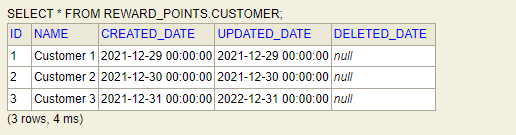
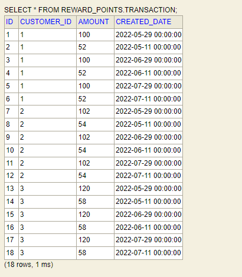
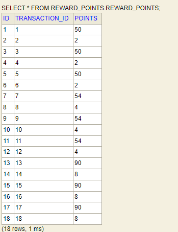
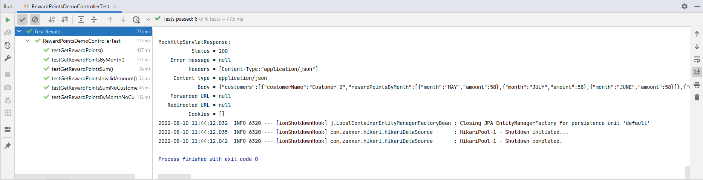

# reward-points-demo
This application demonstrates the rewards program demo

It has 3 endpoints:
1. getRewardPoints: Given an amount in request this endpoint calculates the reward points
2. getRewardPointsByMonth: This endpoint returns reward points per month for the last 3 months of a customer. If no customer provided, this endpoint returns reward points per month for all customers
3. getRewardPointsSum: This endpoint returns reward points sum for the last 3 months of a customer. If no customer provided, this endpoint returns reward points sum for all customers

The API documentation is generated using Open API and it is available at [http://localhost:8080/swagger-ui.html](http://localhost:8080/swagger-ui.html).
and the documentation json file is available at [api-documentation.json](documentation/api-documentation.json)

The project uses H2 database where the dataset is stored and used to serve the endpoints.  

The following is the dataset used for the app:

**Customers**

**Transaction**

The app uses flyway migration to migrate this data to H2 database. After the data is migrated and app is started reward points 
are calculated for these transactions and are added to reward points table. It looks like below:

**Reward Points**

All the properties needed to run the app are externalized in properties file and by default local property is enabled. 

## Running The App

To run the app:
    1. From any ide run _RewardPointsDemoApplication.java_ class
    2. Package the app and run the jar

## Unit tests
To run unit tests run RewardPointsDemoControllerTest.java class. All the tests have been written in junit 5.

 